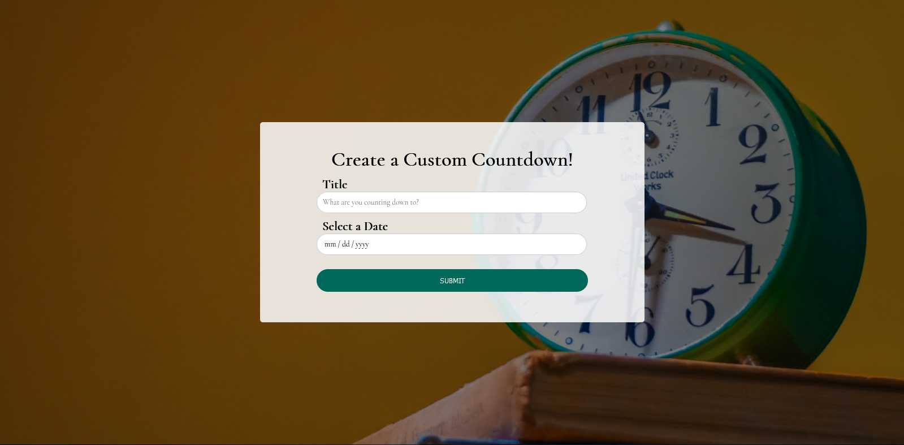
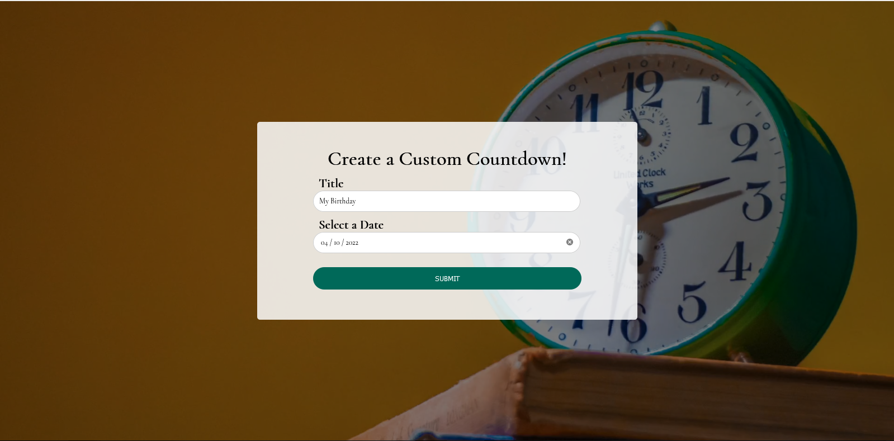
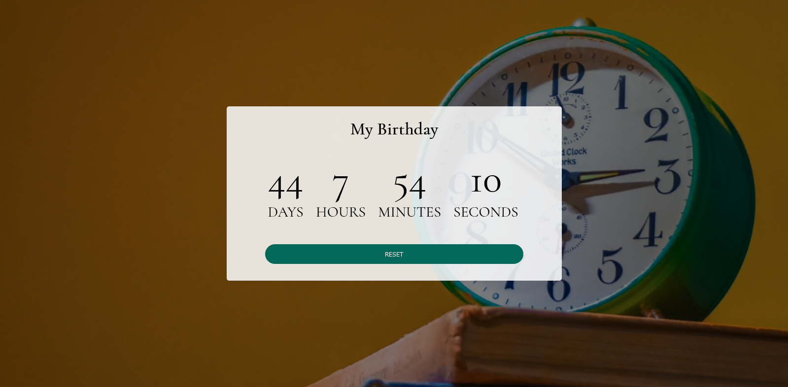

# Custom Countdown Timer

#### Bankist App, 23rd Feb 2022

#### By Wilson Mwangeka

## Description

Bankist App is a fictional banking application that is made with HTML, CSS & JS. So the Bankist app emulates the functions of a banking application where you can view your balance, apply for a loan, transfer money and close an account, you can also view money in and money out and also you are also able to view your interest accrued, there is also a sort feature where you can sort your transactions in descending order. There is also a timer at the bottom of the page that after 5 minutes of inactivity logs the user out.

This custom countdown timer is made with HTML, CSS & JS. The countdown timer lets you put the title of the event that you want to countdown and the date. After that you are able to see the countdown in days, hours, minutes and seconds. I also used the localStorage API to ensure incase you have visited the site before and logged an event and the event isn't yet done counting down, its fetched from the localStorage API.

## How To Interact with the Application
* The site is located at the url 

* So bascially at first you add the title and the date of the title event and submit them.

* Once submitted the application will display the added event title and number of days, hours, minutes and seconds until the event occurs. You can also pick to reset the event title and date and it will return the event title and date input fields where you can add a new event. And please not if you choose to reset it shall also remove the event title and event date from the localStorage API

* And finally when the event date is reached it will display a countdown complete animation and the name of the event and date.

## Known  Bugs
Currently there are no known bugs in the Custom Countdown Timer

## Technologies Used
I used HTML for the sites structure and CSS for the styling and visual presentation and finally JS for the functionality.

## Support and Contact Details
Incase of any question or feedback feel free to reach out to me on my personal email @wilsonmwangeka8@gmail.com

### License

*MIT License*
Copyright (c) 2022 